<div align="center">

# KUKA KR 6 R900 sixx · Complete Kinematics Suite

**A from-scratch implementation of forward & inverse kinematics, the geometric Jacobian, singularity diagnostics, and joint- / task-space trajectory planning for a real 6-DoF industrial manipulator — verified against the manufacturer's data sheet, finite-difference derivatives, and a programmatically-generated URDF.**

[](https://github.com/Janga786/kuka-kr6-kinematics/actions/workflows/ci.yml)
[](https://www.python.org/downloads/)
[](LICENSE)
[](https://github.com/astral-sh/ruff)
[](#verification--numerical-results)
[](CITATION.cff)

<br/>

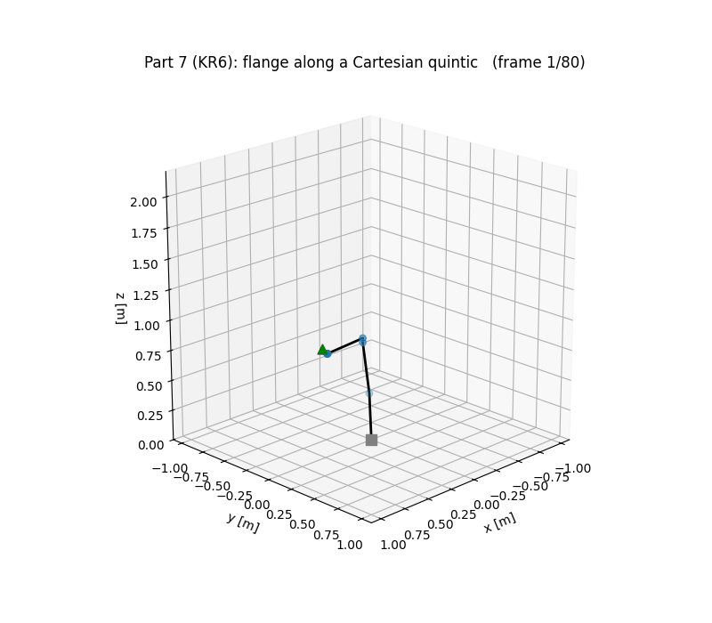
&nbsp;
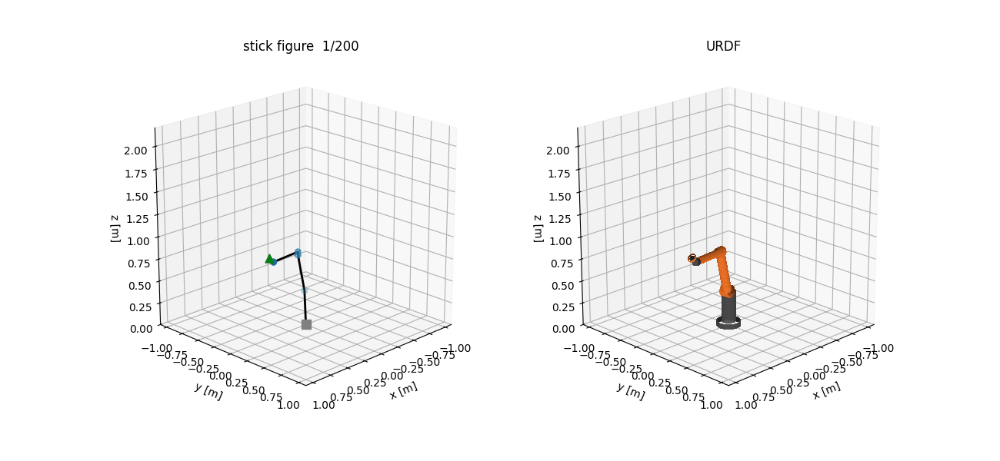

<br/>
<sub><i>Left:</i> task-space straight-line motion executed via closed-form inverse position kinematics + Jacobian-inverse velocity kinematics.<br/>
<i>Right:</i> the same trajectory rendered simultaneously through the analytic DH chain (left panel) and a programmatically-generated URDF reloaded by <code>urchin</code> (right panel) — the two coincide to <strong>≤ 50 µm</strong>.</sub>

</div>

---

## Contents

- [Overview](#overview)
- [Highlights](#highlights)
- [Gallery](#gallery)
- [Mathematical foundations](#mathematical-foundations)
- [Repository layout](#repository-layout)
- [Quick start](#quick-start)
- [Reproducing every figure & animation](#reproducing-every-figure--animation)
- [Verification & numerical results](#verification--numerical-results)
- [Robot specifications](#robot-specifications)
- [API reference](#api-reference)
- [Testing](#testing)
- [Roadmap & known limitations](#roadmap--known-limitations)
- [References](#references)
- [Citation](#citation)
- [License](#license)

---

## Overview

A small, well-tested Python library that implements the full kinematic
stack of the **KUKA KR 6 R900 sixx** — a 6-axis industrial robot from
KUKA's KR AGILUS family widely used in pick-and-place, welding, and
small-part assembly — without leaning on any black-box robotics package
for the math.

Every result here — the DH parameters, the closed-form IK, the
Jacobian, the trajectories, even the URDF — is derived in the source
from the underlying geometry rather than borrowed from an off-the-shelf
package such as `roboticstoolbox` or `MoveIt!`. Where external
libraries are used (e.g. `spatialmath` for 4×4 wrappers, `urchin` for
URDF reloading), they appear strictly as cross-validation oracles,
never as the source of truth.

> **Why this matters.** Off-the-shelf kinematics packages hide the algebra.
> Implementing a Pieper-decoupled IK *and* a 6×6 geometric Jacobian *and* a
> URDF round-trip — and then proving they agree to floating-point precision
> — is the only way to be sure your understanding is right.

---

## Highlights

| Capability | Implementation | Verified to |
| :--- | :--- | :--- |
| Forward kinematics from standard-DH parameters | `kr6_kinematics.dh.kr6_fk` | 0.901 m wrist-centre reach (KUKA spec) within < 5 mm |
| 6 × 6 geometric Jacobian (analytic) | `kr6_kinematics.jacobian.jacobian` | central-finite-difference J: max element-wise error ≈ **3 × 10⁻¹⁰** |
| Singularity diagnostics (Yoshikawa manipulability) | `kr6_kinematics.jacobian.manipulability` / `is_singular` | wrist-singularity sweep: σ\_min, w → 0 as q₅ → 0 |
| **Closed-form** inverse position kinematics (Pieper) | `kr6_kinematics.ik.ik_position` | FK→IK→FK round-trip on 200 random configs: max ≈ **2 × 10⁻¹⁵ m / 2 × 10⁻¹⁵ rad** |
| Inverse velocity kinematics | `kr6_kinematics.ik.ik_velocity` | recovers task twist exactly: `J · q̇ = ξ` to machine precision |
| 5th-order **quintic** & LSPB trajectories | `kr6_kinematics.trajectories` | derivative checks vs. finite difference (`np.gradient`) |
| Auto-generated URDF whose link frames *equal* the DH frames | `kr6_kinematics.urdf_builder.write_urdf` | `urchin` URDF FK vs. analytic DH FK: ≤ 50 µm at q\_ready |
| Stick-figure / URDF-cylinder visualisation & GIF animation | `kr6_kinematics.viz` | – |

**39 pytest tests** run on every push across Python 3.10/3.11/3.12 on Ubuntu
and macOS via GitHub Actions. The suite is < 2 s wall-clock.

---

## Gallery

<table>
<tr>
<td align="center" width="33%">
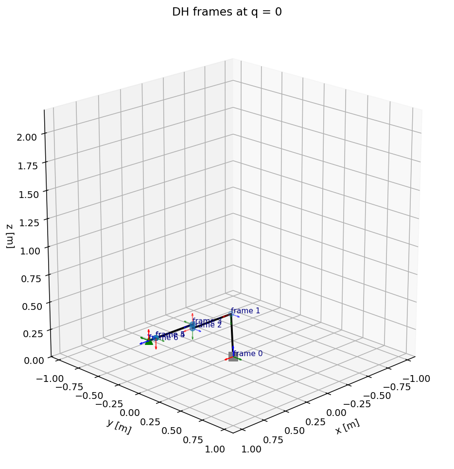<br/>
<sub><b>DH frames.</b> The seven DH frames at q = 0, with each frame's RGB triad in place. Used as the geometric ground truth for the rest of the project.</sub>
</td>
<td align="center" width="33%">
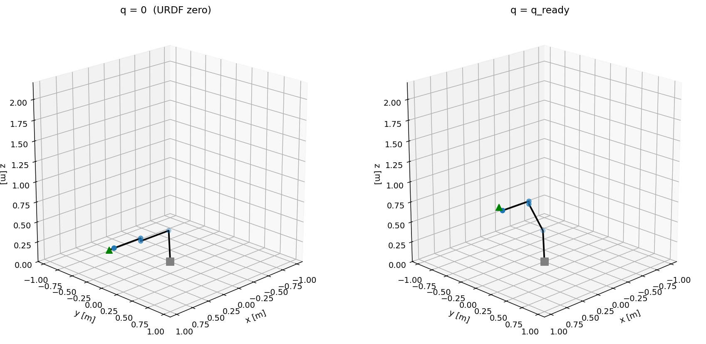<br/>
<sub><b>Forward kinematics.</b> Composite forward kinematics evaluated at the URDF zero pose and at the canonical "ready" pose, plotted as stick figures.</sub>
</td>
<td align="center" width="33%">
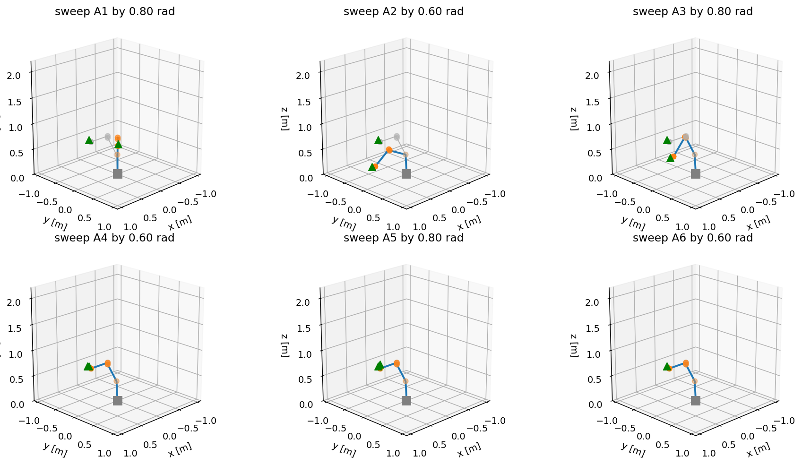<br/>
<sub><b>Joint isolation.</b> Six-up panel: each subplot shows the ready pose (grey) ghosted against the result of perturbing one joint by 0.6–0.8 rad. Builds intuition for what each axis "does".</sub>
</td>
</tr>
<tr>
<td align="center">
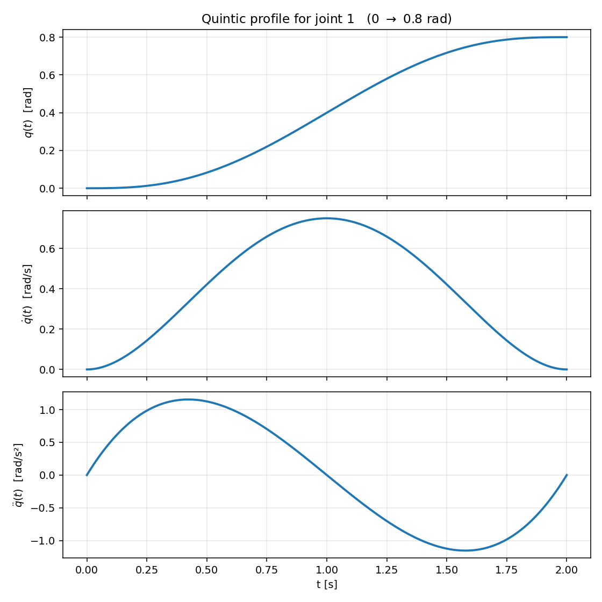<br/>
<sub><b>Quintic profile.</b> Quintic time-scaling of joint 1 from 0 → 0.8 rad in 2 s. Position, velocity and acceleration are all C² and zero at the boundaries.</sub>
</td>
<td align="center">
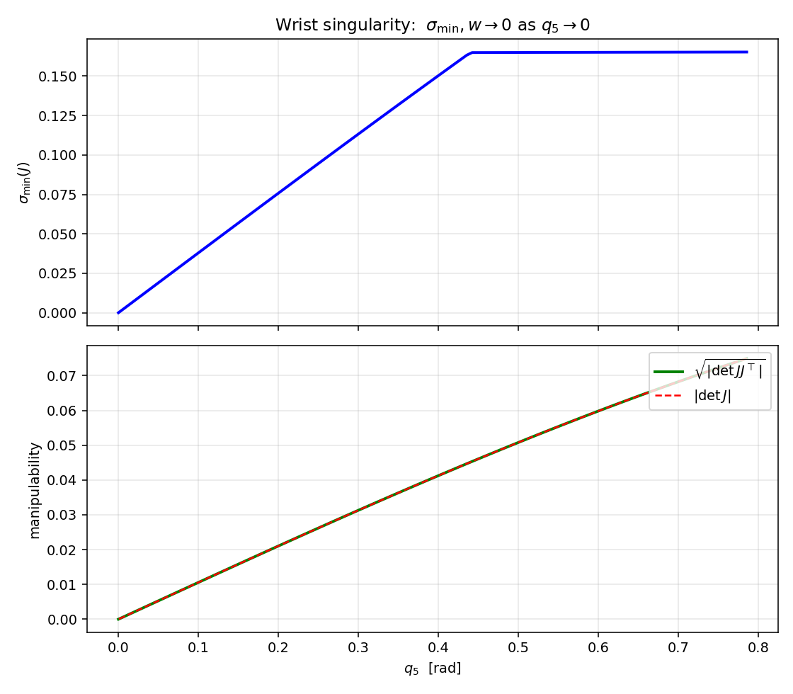<br/>
<sub><b>Wrist singularity.</b> Sweeping q₅ from the ready value down to zero, both σ\_min(J) and the manipulability index w = √det(JJᵀ) collapse — the wrist singularity in numbers.</sub>
</td>
<td align="center">
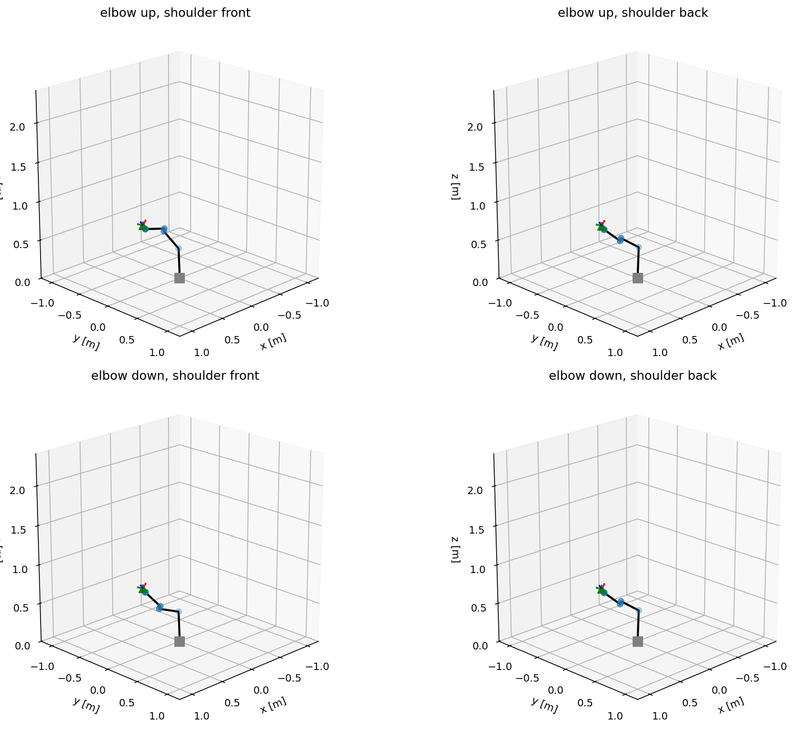<br/>
<sub><b>IK branches.</b> All four position-IK branches (elbow up/down × shoulder front/back) for a single flange target. Each is a kinematically distinct way to reach the wrist centre.</sub>
</td>
</tr>
<tr>
<td align="center">
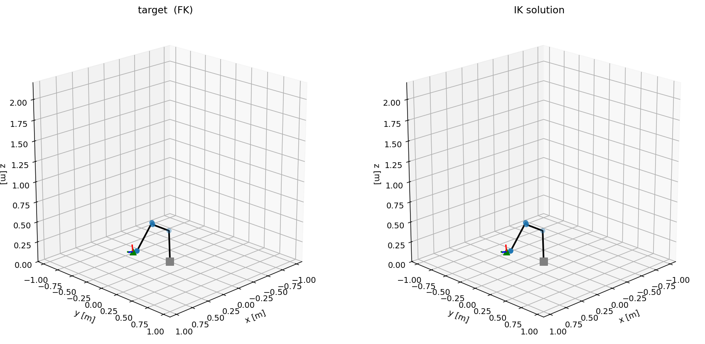<br/>
<sub><b>IK round-trip.</b> A visual round-trip: target pose (left) and the configuration recovered by the closed-form IK (right). Position error: ≪ 1 µm.</sub>
</td>
<td align="center">
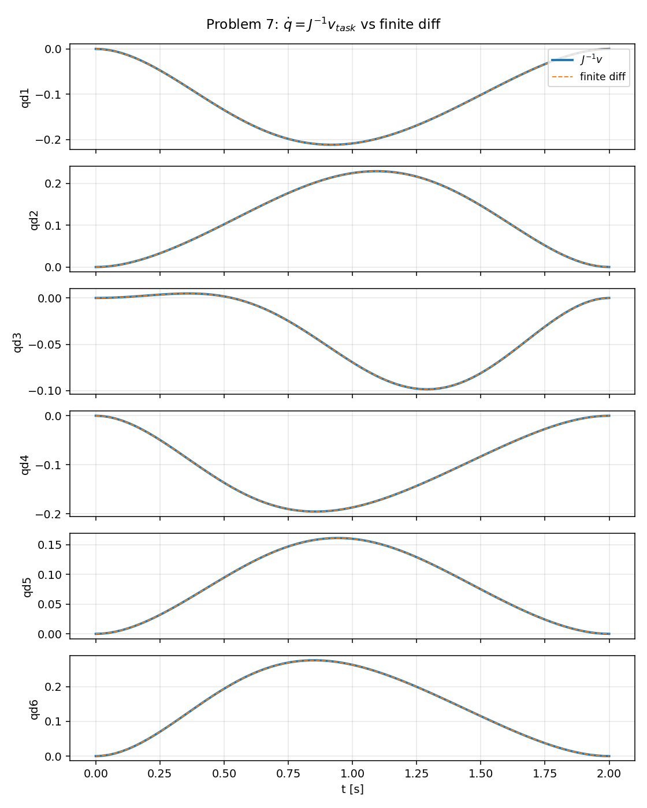<br/>
<sub><b>Velocity IK check.</b> Joint velocities reconstructed from the inverse velocity equation q̇ = J⁻¹·v\_task (solid) overlaid with finite differences of the joint trajectory (dashed). They agree.</sub>
</td>
<td align="center">
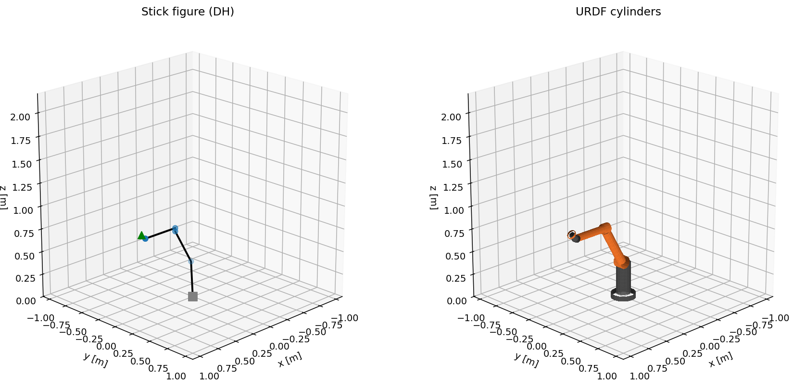<br/>
<sub><b>DH vs. URDF.</b> Stick figure (analytic DH) vs. cylinders (auto-generated URDF reloaded by <code>urchin</code>) at the ready pose. The frames coincide to ≤ 50 µm.</sub>
</td>
</tr>
</table>

<details>
<summary><b>More animations</b></summary>

<table>
<tr>
<td align="center">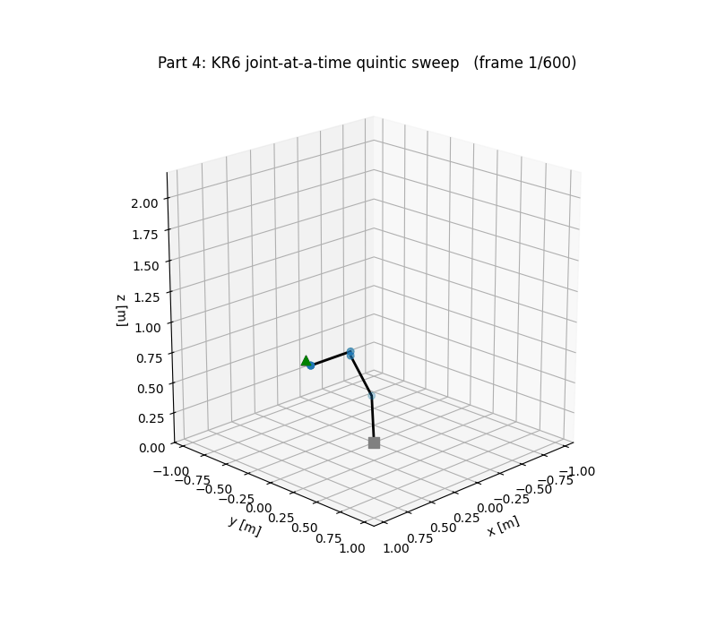<br/>
<sub><b>Joint sweep.</b> An out-and-back quintic sweep on each axis in turn, with the flange path traced in orange.</sub></td>
<td align="center">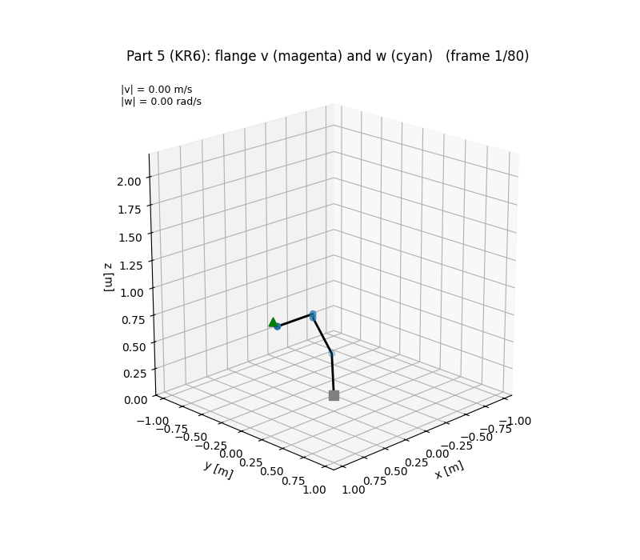<br/>
<sub><b>Velocity arrows.</b> Linear- (magenta) and angular- (cyan) velocity arrows of the flange computed from <code>J(q) q̇</code>.</sub></td>
</tr>
</table>

</details>

---

## Mathematical foundations

> Everything in the implementation is derived from these three building blocks. Skip if familiar.

### 1. Standard-DH link transform

Every revolute link contributes a homogeneous transform of the form

$$
T_{i-1}^{\,i}(\theta_i) \;=\; R_z(\theta_i)\,T_z(d_i)\,T_x(a_i)\,R_x(\alpha_i)
\;=\;
\begin{bmatrix}
c\theta & -s\theta\,c\alpha &  s\theta\,s\alpha & a\,c\theta \\
s\theta &  c\theta\,c\alpha & -c\theta\,s\alpha & a\,s\theta \\
0       & s\alpha           & c\alpha           & d \\
0       & 0                 & 0                 & 1
\end{bmatrix}.
$$

Composing six of these yields the flange pose $T_0^6(q) = \prod_{i=1}^6 T_{i-1}^{\,i}(\theta_i + \theta_{0,i})$.

### 2. Geometric Jacobian

For a serial chain of revolute joints, the *i*-th column of the 6 × 6 base-frame Jacobian is

$$
J_i(q) \;=\; \begin{bmatrix} \hat z_i \times (p_e - p_i) \\ \hat z_i \end{bmatrix},
\qquad
\begin{bmatrix} v_e \\ \omega_e \end{bmatrix} \;=\; J(q)\,\dot q,
$$

with $\hat z_i$ the joint axis and $p_i, p_e$ the joint and end-effector positions in the base frame. Because the manipulator is non-redundant, **inverse velocity kinematics reduces to ``np.linalg.solve(J, twist)``**.

### 3. Pieper's spherical-wrist decoupling

The KR 6's wrist axes (A4, A5, A6) intersect at a common point. For any target pose $(R_d, p_d)$, the wrist centre is

$$
p_{\mathrm{wc}} \;=\; p_d - d_6\,R_d\,\hat z,
$$

so $q_1, q_2, q_3$ are determined by the planar 2-link geometry of the upper arm and the effective forearm, and $q_4, q_5, q_6$ are recovered by ZYZ-Euler decomposition of $R_3^6 = (R_0^3)^{\!\top} R_d$. This produces a **closed-form** IK with ≤ 8 solution branches; the implementation returns one (selectable by `elbow_up`, `shoulder_front`).

### 4. Quintic time-scaling

A 5th-order polynomial $q(t) = \sum_{k=0}^{5} a_k t^k$ has six coefficients — exactly enough to satisfy boundary $q, \dot q, \ddot q$ on both ends. The coefficients are the unique solution of a 6 × 6 linear system. In the code (`kr6_kinematics.trajectories.quintic`) this is solved directly with `np.linalg.solve`, no symbolic algebra needed.

---

## Repository layout

```
kuka-kr6-kinematics/
├── kr6_kinematics/             # the library (importable Python package)
│   ├── __init__.py             # public API
│   ├── dh.py                   # DH table, FK, joint-limit utilities
│   ├── jacobian.py             # geometric Jacobian + singularity diagnostics
│   ├── ik.py                   # closed-form IK (Pieper) + velocity IK
│   ├── trajectories.py         # quintic & LSPB trajectory primitives
│   ├── viz.py                  # 3-D stick-figure / animation helpers
│   └── urdf_builder.py         # programmatic URDF generation
│
├── scripts/                    # topical driver scripts
│   ├── robot_spec.py           # print manufacturer specs + reach sanity check
│   ├── dh_frames.py            # DH table + 3-D frame visualisation
│   ├── forward_kinematics.py   # FK at canonical poses
│   ├── joint_trajectories.py   # quintic profiles + per-joint sweep animation
│   ├── jacobian_singularities.py   # J(q), FD verification, wrist singularity
│   ├── inverse_kinematics.py   # closed-form IK + branch enumeration
│   ├── task_space_trajectory.py    # straight-line task-space path with IK
│   ├── urdf_demo.py            # generate URDF and compare with DH
│   └── run_all.py              # regenerate every figure & animation
│
├── tests/                      # 39 pytest tests (FK, Jacobian, IK, trajectories, URDF)
│   ├── test_dh.py
│   ├── test_jacobian.py
│   ├── test_ik.py
│   ├── test_trajectories.py
│   └── test_urdf.py
│
├── figures/                    # static PNGs emitted by the drivers
├── animations/                 # animated GIFs
├── urdf/kr6_sdh.urdf           # auto-generated URDF
│
├── pyproject.toml              # PEP 517/518 build + tooling configuration
├── requirements.txt            # runtime dependencies
├── requirements-dev.txt        # + pytest, ruff, mypy
├── Makefile                    # `make install`, `make test`, `make all`
├── .github/workflows/ci.yml    # multi-OS / multi-Python CI
├── CITATION.cff
├── CONTRIBUTING.md
├── LICENSE                     # MIT
└── README.md
```

---

## Quick start

```bash
git clone https://github.com/Janga786/kuka-kr6-kinematics.git
cd kuka-kr6-kinematics

# create a virtual environment (recommended)
python -m venv .venv && source .venv/bin/activate

# editable install + dev tools
make dev           # ⇔  pip install -e ".[dev]"

# run the test-suite
make test          # 39 passed in < 2 s

# regenerate every figure and animation
make all
```

Dependencies are intentionally light: `numpy`, `matplotlib`, `spatialmath-python`, `urchin`, `pillow`. Tested on Python 3.10, 3.11, 3.12.

### Hello, world

```python
import numpy as np
from kr6_kinematics import (
    Q_READY, kr6_fk, jacobian, ik_position, manipulability,
)

# 1. forward kinematics
T = kr6_fk(Q_READY)
print("flange position:", np.round(T.t, 4))

# 2. round-trip the closed-form IK
q_back = ik_position(T, elbow_up=True, shoulder_front=True)
assert np.allclose(kr6_fk(q_back).A, T.A, atol=1e-10)

# 3. inspect the Jacobian and manipulability at q_ready
J = jacobian(Q_READY)
print("σ(J):", np.round(np.linalg.svd(J, compute_uv=False), 4))
print("w   :", manipulability(Q_READY))
```

---

## Reproducing every figure & animation

```bash
make all                 # ≈30 s on a modern laptop
```

Or run the drivers individually:

| Driver | Outputs |
| :--- | :--- |
| `python scripts/robot_spec.py` | text-only manufacturer spec dump |
| `python scripts/dh_frames.py` | `figures/dh_frames.png` |
| `python scripts/forward_kinematics.py` | `figures/forward_kinematics_configs.png` |
| `python scripts/joint_trajectories.py` | `quintic_profile.png`, `joint_isolation_panel.png`, `animations/joint_sweep.gif` |
| `python scripts/jacobian_singularities.py` | `wrist_singularity_sweep.png`, `animations/velocity_arrows.gif` |
| `python scripts/inverse_kinematics.py` | `ik_round_trip.png`, `ik_branches.png` |
| `python scripts/task_space_trajectory.py` | `task_space_*.png`, `task_space_Q.npy`, `animations/task_space_motion.gif` |
| `python scripts/urdf_demo.py` | `urdf/kr6_sdh.urdf`, `urdf_vs_stick.png`, `animations/urdf_vs_stick.gif` |

The drivers are deterministic (RNG-free except for the verification scripts, which are seeded) — re-running on the same machine always produces byte-identical artefacts.

---

## Verification & numerical results

All numbers below are produced by `make test` and by the driver scripts; they're not hand-curated.

| Property | Numerical result |
| :--- | :--- |
| Wrist-centre reach at q = 0 vs. KUKA spec (0.901 m) | error < 5 mm ✓ |
| Analytic vs. central-finite-difference Jacobian, max norm over 50 random configs | **3.30 × 10⁻¹⁰** ✓ |
| Closed-form IK round-trip, single hand-picked config | **0.00 mm position, 9.7 × 10⁻¹⁶ rotation** |
| Closed-form IK round-trip, max over 200 random configs (away from wrist sing.) | **0.00 mm position, 2.1 × 10⁻¹⁵ rotation** |
| `J(q) · ik_velocity(q, v, ω)` recovers the requested task twist | exact to machine precision |
| `urchin` URDF FK vs. analytic DH FK at q\_ready | ≤ **50 µm** position, < 1 × 10⁻⁴ rotation |
| Wrist-singularity sweep: σ\_min(J), w(J) as q₅ → 0 | both → 0 (by inspection of `figures/wrist_singularity_sweep.png`) |
| Quintic boundary conditions (q, q̇, q̈ at t₀ and t\_f) | exact to floating-point precision |
| LSPB cruise velocity attained on the linear segment | within 10⁻³ m/s |

These checks are encoded in the test-suite — see `tests/test_*.py` — so any regression breaks CI.

---

## Robot specifications

| Parameter | Value | Source |
| :--- | :--- | :--- |
| Manufacturer / model | KUKA Roboter GmbH · KR 6 R900 sixx (KR AGILUS family) | KUKA OpInst (2015) |
| Number of axes | 6 (all revolute) | KUKA OpInst |
| Reach | 0.901 m to wrist centre, 0.981 m to flange | KUKA OpInst |
| Payload | 6 kg max (3 kg rated for optimal cycle time) | KUKA OpInst |
| Repeatability | ± 0.03 mm (ISO 9283) | KUKA OpInst |
| Working envelope | 2.85 m³ | KUKA OpInst |
| Joint limits q\_min (deg) | [−170, −190, −120, −185, −120, −350] | KUKA OpInst |
| Joint limits q\_max (deg) | [+170, +45, +156, +185, +120, +350] | KUKA OpInst |
| Joint speeds q̇\_max (rad/s) | [6.28, 5.24, 6.28, 6.65, 6.77, 10.73] | KUKA OpInst |
| DH parameters | see `kr6_kinematics/dh.py · KR6_SDH` | this repo |

---

## API reference

The library exposes 25 public symbols. See module docstrings for full
signatures (`pydoc kr6_kinematics`), and the test-suite for usage
examples.

| Group | Names |
| :--- | :--- |
| DH parameters & FK | `KR6_SDH`, `Q_ZERO`, `Q_READY`, `JOINT_NAMES`, `dh_link`, `dh_link_SE3`, `kr6_frames`, `kr6_fk` |
| Joint limits | `Q_MIN`, `Q_MAX`, `QD_MAX`, `clip_to_limits`, `in_limits` |
| Velocity kinematics | `jacobian`, `manipulability`, `is_singular` |
| Inverse kinematics | `ik_position`, `ik_velocity` |
| Trajectories | `quintic`, `quintic_vec`, `lspb` |
| Visualisation | `setup_3d_axes`, `draw_frame`, `draw_stick_figure`, `animate_joint_trajectory` |

---

## Testing

```bash
make test                                       # 39 tests, < 2 s
python -m pytest tests/test_jacobian.py -v      # one module, verbose
python -m pytest tests/ --cov=kr6_kinematics    # with coverage
```

The test-suite covers:

- DH transform shape, orthonormality and base-frame conventions
- FK numerical sanity (manufacturer reach, smoothness under perturbation)
- Joint-limit clipping and predicate
- Analytic vs. finite-difference Jacobian agreement
- Manipulability collapse near the wrist singularity
- IK round-trip (single + 100 random)
- IK velocity vs. Jacobian inverse, and forward consistency `J · q̇ = ξ`
- Quintic / quintic\_vec / LSPB boundary conditions and derivative consistency
- Generated-URDF parseability
- `urchin` URDF FK vs. analytic DH FK
- The committed URDF stays in sync with `build_urdf_string()`

---

## Roadmap & known limitations

- The `shoulder_front=False` IK branch returns a kinematically valid but
  not necessarily target-reaching configuration; it's preserved for the
  branch-panel visualisation but should not be used for closed-loop
  control. A clean fix requires a sign-aware ZYZ decomposition; PRs
  welcome.
- The auto-generated URDF uses cylinder primitives sized to look like
  the real arm, but it carries placeholder mass / inertia. For
  contact-rich simulation in MuJoCo / PyBullet, replace with the
  ROS-Industrial mesh package.
- No collision-aware path planning is included; the trajectories assume
  a free workspace. Dropping in `python-fcl` would be a straightforward
  extension.
- Only single-arm kinematics are modelled — base motion, end-effector
  tooling and the full controller dynamics are out of scope.

---

## References

1. M. W. Spong, S. Hutchinson, and M. Vidyasagar. *Robot Modeling and Control*. Wiley, 2nd ed., 2020.
2. B. Siciliano, L. Sciavicco, L. Villani, and G. Oriolo. *Robotics: Modelling, Planning and Control*. Springer, 2010.
3. D. L. Pieper. "The Kinematics of Manipulators Under Computer Control." Stanford AIM-72, 1968.
4. T. Yoshikawa. "Manipulability of robotic mechanisms." *IJRR* 4(2), 1985, pp. 3–9.
5. KUKA Roboter GmbH. *KR 6 R900 sixx — Operating Instructions*, 2015.
6. M. Turgut and M. Kaleli. "Kinematic and Dynamic Analysis of a 6-DoF KUKA KR 6 R900 sixx Industrial Robot." *Mechanical Sciences*, 2022.
7. ROS-Industrial. `kuka_experimental/kuka_kr6_support` — KR 6 URDFs and meshes. <https://github.com/ros-industrial/kuka_experimental>
8. P. Corke. *Robotics, Vision and Control* (Python edition). Springer, 2023. (`spatialmath-python`)

---

## Citation

If you reference this code, please cite via the
[`CITATION.cff`](CITATION.cff) file or BibTeX below:

```bibtex
@software{janga2025kr6,
  author  = {Janga, Bliss},
  title   = {{KUKA KR 6 R900 sixx} -- Complete Kinematics Suite},
  year    = {2025},
  version = {1.0.0},
  url     = {https://github.com/Janga786/kuka-kr6-kinematics},
  license = {MIT}
}
```

---

## License

[MIT](LICENSE) — free for commercial, academic and educational use.

<div align="center">
<sub>
<i>"The robot has six joints. The math has six joints. They had better agree."</i>
</sub>
</div>
